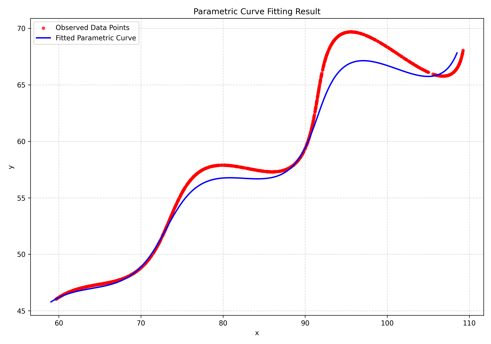

<h1 align="center">🚀 Optimizing a Dynamic Trajectory</h1>

<p align="center">
  <i>AI Research & Development Assignment</i><br>
  <b>Author:</b> Prathikha<br>

</p>

<p align="center">
  <!-- Shields.io Badges for Technologies Used -->
  
  
  
  
  
</p>

---
##  Project Overview

This repository presents a comprehensive solution to a **parametric curve fitting** problem modeling observed `(x, y)` data points with a nonlinear parametric equation and identifying optimal parameters that minimize the **L1 distance** (Manhattan distance) between the predicted and observed data.

The project combines **numerical optimization**, **parametric modeling**, and **data visualization** to demonstrate a research-oriented approach to real-world nonlinear curve fitting.

---

## 🎯 Problem Statement

Given a dataset `xy_data.csv` containing `x` and `y` coordinates, the objective is to find the optimal values for three unknown parameters: `theta`, `M`, and `X`. These parameters define a parametric curve using the following equations:

**x(t) = t * cos(theta) - exp(M * |t|) * sin(0.3 * t) * sin(theta) + X**

**y(t) = 42 + t * sin(theta) + exp(M * |t|) * sin(0.3 * t) * cos(theta)**


The goal is to minimize the L1 distance (Manhattan distance) between the observed data points and the points generated by the parametric equations.


---

## Key Features & Technologies

- **Numerical Optimization:** Utilizes `scipy.optimize.differential_evolution` for global optimization, ensuring a robust search for the optimal parameters across a defined parameter space.
- **L1 Distance Metric:** Minimizes the sum of absolute differences — more robust to outliers than L2 norm.  
- **Parametric Curve Modeling:** Implements nonlinear equations with trigonometric and exponential components.  
- **Data Visualization:** Leverages `matplotlib` to visually compare the observed data points with the fitted parametric curve, providing an intuitive understanding of the fitting accuracy.
- **Reproducibility:** Incorporates `np.random.seed(42)` and `random.seed(42)` to ensure consistent results on every run, a crucial aspect for scientific computing.


---

##  🧩 Step-by-Step Process

### 1️⃣ Data Loading
- The dataset `xy_data.csv` is read using **Pandas**, and `x_data`, `y_data` arrays are extracted.
- A corresponding `t_range` (6 → 60) is assumed for sequential sampling.

### 2️⃣ Defining the Model
Two parametric equations (`parametric_x` and `parametric_y`) are implemented.  
- `theta` is converted to radians (`np.deg2rad`) for trigonometric computations.  
- The exponential term adds nonlinear scaling with respect to `M` and `t`.

### 3️⃣ Defining the Objective Function
- The **error function** computes the total **L1 distance** between observed and predicted points:
  ```python
  L1 = np.sum(np.abs(x_pred - x_data)) + np.sum(np.abs(y_pred - y_data))
  ```
- This function is minimized during optimization.

### 4️⃣ Setting Parameter Bounds
| Parameter | Description | Range |
|------------|--------------|--------|
| `theta` | Angle of rotation (in degrees) | 0 – 50 |
| `M` | Exponential growth/decay factor | -0.05 – 0.05 |
| `X` | Horizontal shift | 0 – 100 |

### 5️⃣ Global Optimization with Differential Evolution
- `scipy.optimize.differential_evolution` is used for robust global search.
- It works well with **non-convex, multi-modal** objective surfaces.
- Seeded with `42` for reproducibility.

### 6️⃣ Results Extraction
After optimization:
- Extract best-fit parameters:
  ```
  Optimal Theta: 27.9990 degrees
  Optimal M: 0.0211
  Optimal X: 54.2703
  Minimum L1 Error: 37873.4825
  ```
- Results are saved in `fit_results.txt`.

### 7️⃣ Visualization
A smooth fitted curve is generated and compared to observed data:
- **🔴 Red Points:** Observed Data  
- **🔵 Blue Curve:** Fitted Model  

Output visualization  


### 🎯 Interactive Visualization  
Explore the optimized trajectory interactively on Desmos:  
[🔗 Open Live Graph on Desmos](https://www.desmos.com/calculator/zt1hdklypi)


---

## 💻 Installation & Usage

### 1. Clone the Repository
```bash
git clone https://github.com/YOUR_USERNAME/parametric-curve-fitting.git
cd parametric-curve-fitting
```
### 2. Set Up Environment
```bash
pip install numpy pandas scipy matplotlib
```

### 3. Run the Notebook
Open the Jupyter Notebook and run all the cells in order
```bash
jupyter notebook
```

### 4. Outputs
- 📄 `fit_results.txt` → numerical results  
- 🖼️ `parametric_fit_result.png` → visualization  
- 🧾 Console → optimized parameters + minimum L1 error    

---

## 🧾 Evaluation Criteria & My Approach

| **Criterion** | **Implementation / Explanation** |
|----------------|----------------------------------|
| **L1 Distance Accuracy (100 pts)** | Used L1 norm for robustness; ensures minimal deviation even with outliers. |
| **Process Explanation (80 pts)** | Step-by-step documentation of mathematical reasoning and computational pipeline. |
| **Code Quality (50 pts)** | Structured, reproducible, and well-documented code with automated output saving. |

---

## 🧠  Conceptual Insights

- **Parametric Modeling:** Enables flexible transformations like scaling, rotation, and translation.  
- **L1 vs L2:** L1 provides stability and resistance to large residuals.  
- **Global Optimization:** Differential Evolution avoids local minima traps that plague gradient-based methods.  
- **Visualization:** Critical to validate and interpret fitting quality intuitively.

---

## 📁 Folder Structure

```
📁 parametric-curve-fitting
│
├── xy_data.csv                  # Input dataset
├── parametric_fit.py            # Main script
├── fit_results.txt              # Optimization results
├── parametric_fit_result.png    # Output visualization
└── README.md                    # Documentation
```

---

## Contributing

1. Fork the repository
2. Create a feature branch
3. Make your changes
4. Add tests if applicable
5. Submit a pull request

In case of any queries, please leave a message or contact me via the email provided in my profile.

---

<p align="center">
⭐ <strong>Star this repository if you found it helpful!</strong>
</p>


